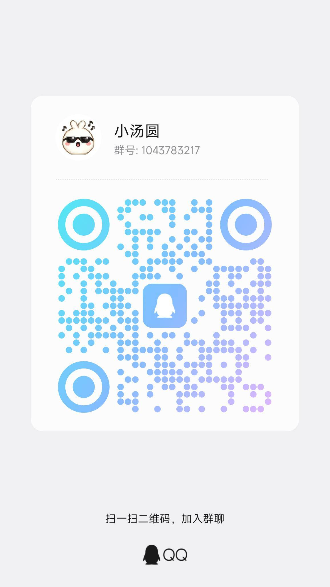
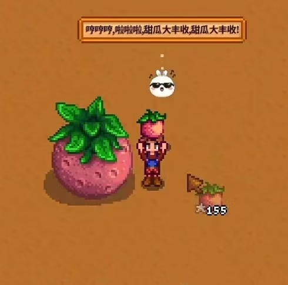
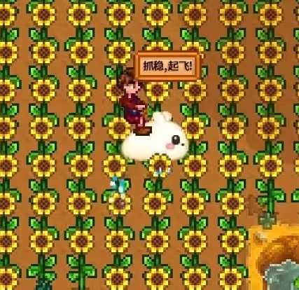
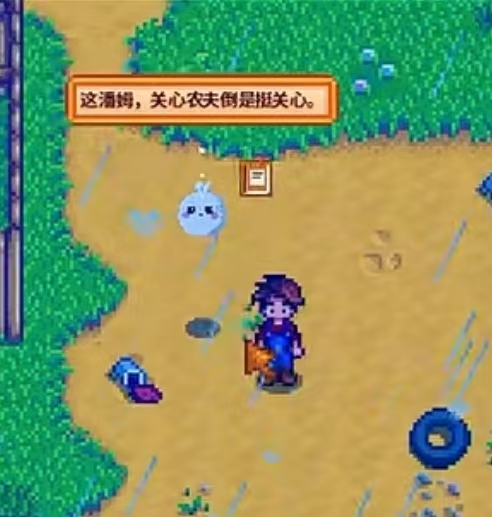

<p align="center">
  
</p>

# AI Native Game Harness

## 让游戏里的 AI 不只会聊天，还能真正理解和参与游戏

AI Native Game Harness 想为玩家提供一个可以进入不同游戏的 AI 伙伴：它能看懂当前局面、听懂玩家说话、记住共同经历，并在游戏允许的范围内完成真实动作。

对于游戏开发者和 MOD 作者，它提供一套可复用的 AI 游戏底座。你只需要描述自己的游戏世界、状态和可执行动作，不必为每款游戏重新开发模型接入、语音、记忆、工具调用和桌面应用。

> `v1.0.0` 源码版本已经发布。`main` 已能生成并完成本地安装、启动、内置 DSH Runtime 和卸载验证的 Windows NSIS 安装包；当前产物尚未数字签名，也还没有作为正式 Release 对外发布。

> `1.0` 分支和 `v1.0.0` 标签保存稳定源码；`main` 当前标记为 `1.1.0-dev.0` 开发线，后续改动不会反向进入 1.0 稳定版本。

**[玩家版官网](https://qimidandapigu.github.io/ai-native-game-harness/)** · **[开发者版官网](https://qimidandapigu.github.io/ai-native-game-harness/developers.html)** · **[完整技术理念](docs/AI_GAME_ENGINE_IDEOLOGY.html)** · **[接入一个新游戏](docs/INDEPENDENT_PLATFORM.md)** · **[查看版本发布](https://github.com/qimidandapigu/ai-native-game-harness/releases)**

## 关注小汤圆，加入交流群

想看最新视频和项目动态，可以关注小红书；想交流 AI 游戏或参与测试，可以加入 QQ 群。

- **小红书：[@小红鼠煮大汤圆](https://www.xiaohongshu.com/user/profile/65f497a500000000050094cf)**
- **QQ群：1043783217**

<p align="center">
  
</p>

## 玩家能得到什么

### 一个真正了解游戏的 AI 伙伴

AI 不只读取聊天内容。游戏可以把角色状态、背包、附近目标、任务和当前场景准确地告诉它，让回答建立在真实局面上。

### 用文字或语音一起玩

玩家可以询问情况、讨论计划，也可以要求 AI 执行游戏提供的动作。动作是否成功由游戏确认，AI 不能只用一句话假装任务已经完成。

### 跨存档的共同经历

记忆和会话按游戏与存档隔离。重新进入同一个存档时，AI 可以接着之前的交流继续陪伴；切换存档时不会串用另一段经历。

### 剧情由当前局面实时生成

项目的核心不是播放一份预先写死的任务表。同一个 DSH Session 会根据 Game Pack 中的世界观与角色边界、玩家选择和 Adapter 返回的当前事实，滚动生成接下来 1–3 个短剧情片段。Story Runtime 负责校验和按 `gameId + saveId` 保存；目标是否完成仍必须由游戏状态证明。

### 会学习，但不会乱学

AI 可以把多步操作写成受限的技能流程，处理条件判断、有限重复和失败回退。只有在真实游戏中完整试跑成功，技能才会保存；失败尝试只用于改进和排错。

### 一个应用连接多款游戏

桌面应用可以在通用 Harness 页面和游戏专属页面之间切换；不同游戏包继续按需安装，不需要把所有适配器和 MOD 一次性下载下来。

## 对游戏开发者和 MOD 作者的价值

- **更快做出 AI 玩法**：把精力放在角色、剧情、规则和游戏专属动作上。
- **复用动态剧情生成器**：在 Game Pack 中提供世界观与叙事约束，不必把整条剧情树写死。
- **复用成熟能力**：统一使用模型、语音、视觉、记忆、会话和工具系统。
- **不绑定单一模型厂商**：游戏接入面向能力，而不是写死某一家 API。
- **支持不同技术栈**：游戏侧可以使用 C#、Lua、C++ 或其他语言。
- **更容易测试和排错**：每次动作都能关联请求、结果、耗时和更新后的游戏状态。
- **按游戏独立发布**：每个游戏包可以单独安装、升级和卸载。

## 目标使用体验

```text
安装 AI Native Game Harness
        ↓
选择游戏并安装对应游戏包
        ↓
进入游戏，用文字或语音和 AI 对话
        ↓
AI 理解当前状态，生成或延续短剧情，并回答或请求执行动作
        ↓
游戏确认结果，AI 继续观察、协作和学习
```

这套体验仍在开发中。当前源码和本地安装包已经具备主要产品组件，但在正式数字签名、真实游戏长期验收和公开 Release 完成前，仍不应当写成普通玩家正式版。

## 当前游戏

| 游戏 | 想实现的体验 | 当前阶段 |
| --- | --- | --- |
| 星露谷物语 | 可对话、能理解农场生活并陪伴成长的小汤圆 | 开发验证中 |
| 饥荒联机版 | 能观察生存状态、协助执行任务和学习技能的伙伴 | 开发验证中 |
| 缺氧 | 能理解殖民地、复制人和建造任务的悬浮 AI 伙伴 | 开发验证中 |
| Mock Game | 用于验证连接、动作、安全和状态更新 | 自动测试可用 |

## 真实游戏开发画面

以下截图来自项目开发验证记录，用于展示 AI 伙伴已经进入真实游戏场景后的交互方向；它们不是对应游戏的官方宣传或合作声明。游戏名称、画面与原始素材权利归各自权利方所有。

<table>
  <tr>
    <td width="33%"><br><strong>一起见证农场成长</strong><br>AI 根据当前农场事件回应，而不是脱离存档编写结果。</td>
    <td width="33%"><br><strong>不只聊天，也能参与玩法</strong><br>角色表达、游戏事件和动作能力可以组成真实的 AI 游戏体验。</td>
    <td width="33%"><br><strong>对当前环境作出回应</strong><br>天气、地点和附近事件都可以成为对话与动态剧情的事实上下文。</td>
  </tr>
</table>

## 产品原则

- **游戏事实优先**：物品、金钱、任务、位置和胜负以游戏返回结果为准。
- **玩家保持控制权**：游戏只开放明确允许的动作，敏感能力需要授权。
- **本机连接优先**：游戏与桌面应用默认通过本机通信，不向局域网公开端口。
- **按需安装**：不同游戏的能力独立管理，不强迫用户下载无关内容。
- **过程可解释**：可以查看 AI 调用了什么、游戏返回了什么，以及失败发生在哪一步。

## 现在可以使用吗？

| 使用者 | 当前建议 |
| --- | --- |
| 普通玩家 | 可以查看 `v1.0.0` 稳定源码；`main` 的本地一键安装包已验证，但尚未签名或公开发布 |
| 游戏开发者 / MOD 作者 | 可以使用 Adapter Starter 和 Mock Game 评估接入方式 |
| 项目贡献者 | 可以运行源码、自动测试和桌面演示 |

当前 `main` 已通过 29 项集成测试和 20 项平台测试，并通过饥荒、反馈服务、缺氧 Adapter 与小汤圆插件的专项检查。`smoke:dsh-story` 还会让当前 DSH 模型真实生成一段 Mock Game 剧情、完成金币目标，并在第二次启动后读回历史。Windows 安装器已完成不依赖系统 Node/pnpm 的安装、内置 DSH 页面 HTTP 200、媒体宿主启动和完整卸载验证；一次剧情冒烟和一次本机安装验收仍不等于长期剧情质量、真实游戏或正式签名 Release 已经完成。

## 开发者体验

需要 Node.js 22.19+ 和 pnpm 10.28.2：

```powershell
git clone https://github.com/qimidandapigu/ai-native-game-harness.git
cd ai-native-game-harness
pnpm install --frozen-lockfile
pnpm check
pnpm smoke:dsh-story
pnpm desktop:demo
```

第三方游戏接入可以从 [`examples/adapter-starter`](examples/adapter-starter) 开始。

## 进一步了解

- [产品定位与完整介绍](docs/AI_GAME_ENGINE_IDEOLOGY.html)
- [第三方游戏接入说明](docs/INDEPENDENT_PLATFORM.md)
- [游戏安装与升级](docs/xiaotangyuan/INSTALLATION.md)
- [常见问题与排错](docs/xiaotangyuan/TROUBLESHOOTING.md)
- [内部开发状态与技术决策](docs/INTERNAL_DEVELOPMENT.md)

## License

[MIT](LICENSE)
