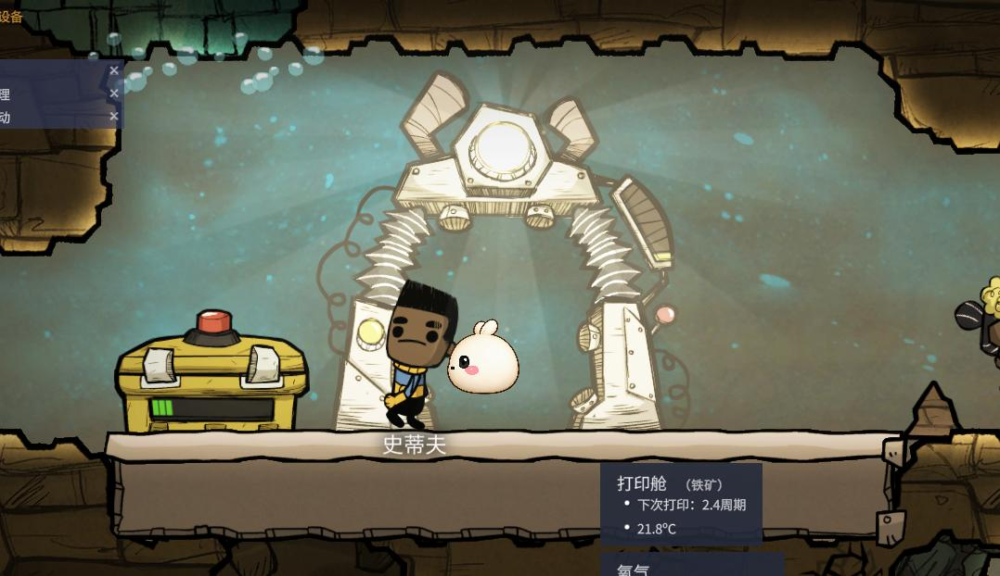
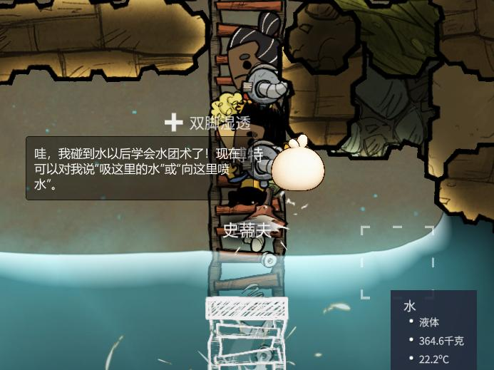
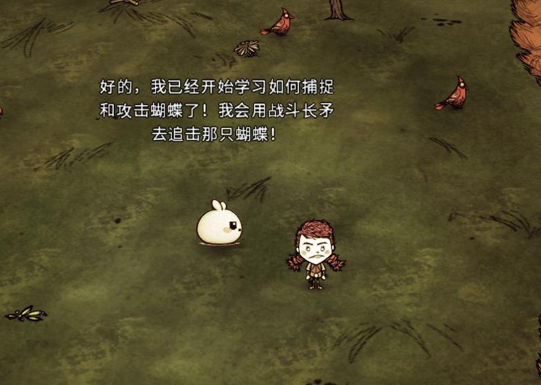

<p align="center">
  
</p>

# AI Native Game Harness

## 让游戏里的 AI 不只会聊天，还能真正理解和参与游戏

AI Native Game Harness 想为玩家提供一个可以进入不同游戏的 AI 伙伴：它能看懂当前局面、听懂玩家说话、记住共同经历，并在游戏允许的范围内完成真实动作。

对于游戏开发者和 MOD 作者，它提供一套可复用的 AI 游戏底座。你只需要描述自己的游戏世界、状态和可执行动作，不必为每款游戏重新开发模型接入、语音、记忆、工具调用和桌面应用。

> `v1.1.0` 稳定源码版本已经发布，保存当前玩家版、开发者版、完整技术理念、游戏 Harness 与多游戏接入代码。Windows NSIS 安装包已完成本地安装、启动、内置 DSH Runtime 和卸载验证，但尚未数字签名，也没有作为正式 Release 资产对外发布。

> `1.0` / `v1.0.0` 保留第一份稳定快照；`1.1` 分支、`v1.1.0` 标签与 GitHub Release 保存本次稳定源码。封版时 `main` 与 `v1.1.0` 一致，后续开发不会反向修改这两个稳定版本。

**[玩家版官网](https://qimidandapigu.github.io/ai-native-game-harness/)** · **[开发者版官网](https://qimidandapigu.github.io/ai-native-game-harness/developers.html)** · **[完整技术理念](docs/AI_GAME_ENGINE_IDEOLOGY.html)** · **[接入一个新游戏](docs/INDEPENDENT_PLATFORM.md)** · **[查看版本发布](https://github.com/qimidandapigu/ai-native-game-harness/releases)**

## 关注小汤圆，加入交流群

想看最新视频和项目动态，可以关注小红书；想交流 AI 游戏或参与测试，可以加入 QQ 群。

- **小红书：[@小红鼠煮大汤圆](https://www.xiaohongshu.com/user/profile/65f497a500000000050094cf)**
- **QQ群：1043783217**

<p align="center">
  
</p>

## 玩家能得到什么

### 一个真正了解游戏的 AI 伙伴

AI 不只读取聊天内容。游戏可以把角色状态、背包、附近目标、任务和当前场景准确地告诉它，让回答建立在真实局面上。

### 用文字或语音一起玩

玩家可以询问情况、讨论计划，也可以要求 AI 执行游戏提供的动作。动作是否成功由游戏确认，AI 不能只用一句话假装任务已经完成。

### 跨存档的共同经历

记忆和会话按游戏与存档隔离。重新进入同一个存档时，AI 可以接着之前的交流继续陪伴；切换存档时不会串用另一段经历。

### 剧情由当前局面实时生成

项目的核心不是播放一份预先写死的任务表。同一个 DSH Session 会根据 Game Pack 中的世界观与角色边界、玩家选择和 Adapter 返回的当前事实，滚动生成接下来 1–3 个短剧情片段。Story Runtime 负责校验和按 `gameId + saveId` 保存；目标是否完成仍必须由游戏状态证明。

### 会学习，但不会乱学

AI 可以把多步操作写成受限的技能流程，处理条件判断、有限重复和失败回退。只有在真实游戏中完整试跑成功，技能才会保存；失败尝试只用于改进和排错。

### 边玩边把工作交给 Harness

**让 AI 上班，让人回家玩游戏。** 这是 Harness 的一项可选工作编排能力：玩家先和游戏里的小汤圆正常交流；当前回复结束后，后台再识别长期工作意图，并创建或恢复独立 Worker DSH Session。公开进度和结果会返回原陪伴 Session，因此同一套能力也能被其他 NPC、桌面宠物或陪伴角色复用。

该能力已独立维护在 [dsh-agh-work-orchestrator](https://github.com/qimidandapigu/dsh-agh-work-orchestrator)，运行时包名为 `@qimidandapigu/dsh-work-orchestrator`。当前 `0.1.7` 发布的是 Git 源码，尚未声明已发布到 npm；它不建立第二套任务中心，工作事实、对话和成果仍由 DSH Session 与 Workspace 保存。

AI 不应该只是让人一天完成三天的工作。生产力继续提高以后，人应该得到更多时间去游戏、娱乐、创造和生活；人负责提出目标、判断方向，繁琐的执行交给 AI。

### 开源核心与产品服务分层

本仓库只维护可以公开复用的本地核心：游戏协议、Adapter、DSH 插件、NPC 工作编排、桌面基础能力和自动验收。账号、额度、支付以及托管模型路由不是公共核心的依赖，也不会把服务器密钥或商业实现放进游戏 MOD。

未来的正式产品可以在开源核心之上增加可选的登录和云服务，但依赖方向始终是单向的：产品发行版消费一个固定的公开版本，公共仓库不会反向依赖私有服务。只使用开源版本的开发者仍然可以自行配置模型并运行本地能力。

### 一个应用连接多款游戏

桌面应用可以在通用 Harness 页面和游戏专属页面之间切换；不同游戏包继续按需安装，不需要把所有适配器和 MOD 一次性下载下来。

## 对游戏开发者和 MOD 作者的价值

- **更快做出 AI 玩法**：把精力放在角色、剧情、规则和游戏专属动作上。
- **复用动态剧情生成器**：在 Game Pack 中提供世界观与叙事约束，不必把整条剧情树写死。
- **复用成熟能力**：统一使用模型、语音、视觉、记忆、会话和工具系统。
- **不绑定单一模型厂商**：游戏接入面向能力，而不是写死某一家 API。
- **支持不同技术栈**：游戏侧可以使用 C#、Lua、C++ 或其他语言。
- **更容易测试和排错**：每次动作都能关联请求、结果、耗时和更新后的游戏状态。
- **按游戏独立发布**：每个游戏包可以单独安装、升级和卸载。

## 目标使用体验

```text
安装 AI Native Game Harness
        ↓
选择游戏并安装对应游戏包
        ↓
进入游戏，用文字或语音和 AI 对话
        ↓
AI 理解当前状态，生成或延续短剧情，并回答或请求执行动作
        ↓
游戏确认结果，AI 继续观察、协作和学习
```

这套体验仍在开发中。当前源码和本地安装包已经具备主要产品组件，但在正式数字签名、真实游戏长期验收和公开 Release 完成前，仍不应当写成普通玩家正式版。

## 当前游戏

| 游戏 | 想实现的体验 | 当前阶段 |
| --- | --- | --- |
| 星露谷物语 | 可对话、能理解农场生活并陪伴成长的小汤圆 | 开发验证中 |
| 饥荒联机版 | 能观察生存状态、协助执行任务和学习技能的伙伴 | 开发验证中 |
| 缺氧 | 能理解殖民地、复制人和建造任务的悬浮 AI 伙伴 | 开发验证中 |
| Mock Game | 用于验证连接、动作、安全和状态更新 | 自动测试可用 |

## 真实游戏开发画面

以下截图来自项目开发验证记录，用于展示 AI 伙伴已经进入真实游戏场景后的交互方向；它们不是对应游戏的官方宣传或合作声明。游戏名称、画面与原始素材权利归各自权利方所有。

<table>
  <tr>
    <td width="33%"><br><strong>一起见证农场成长</strong><br>AI 根据当前农场事件回应，而不是脱离存档编写结果。</td>
    <td width="33%"><br><strong>不只聊天，也能参与玩法</strong><br>角色表达、游戏事件和动作能力可以组成真实的 AI 游戏体验。</td>
    <td width="33%"><br><strong>对当前环境作出回应</strong><br>天气、地点和附近事件都可以成为对话与动态剧情的事实上下文。</td>
  </tr>
  <tr>
    <td width="33%"><br><strong>成为殖民地的一员</strong><br>小汤圆以游戏内角色存在，能围绕复制人与殖民地的真实状态继续陪伴。</td>
    <td width="33%"><br><strong>从环境中获得新能力</strong><br>能力由真实游戏事件触发，并通过游戏规则确认是否已经学会和生效。</td>
    <td width="33%"><br><strong>把玩家目标转成行动</strong><br>AI 结合当前世界与可用能力理解请求，形成可继续执行和验证的行动方向。</td>
  </tr>
</table>

## 产品原则

- **游戏事实优先**：物品、金钱、任务、位置和胜负以游戏返回结果为准。
- **玩家保持控制权**：游戏只开放明确允许的动作，敏感能力需要授权。
- **本机连接优先**：游戏与桌面应用默认通过本机通信，不向局域网公开端口。
- **按需安装**：不同游戏的能力独立管理，不强迫用户下载无关内容。
- **工作能力独立**：Work Orchestrator 是通用 DSH 插件，不与小汤圆角色、某个游戏或 Desktop UI 绑定。
- **过程可解释**：可以查看 AI 调用了什么、游戏返回了什么，以及失败发生在哪一步。

## 现在可以使用吗？

| 使用者 | 当前建议 |
| --- | --- |
| 普通玩家 | 可以查看 `v1.1.0` 稳定源码；本地一键安装包已验证，但尚未签名或作为 Release 资产公开发布 |
| 游戏开发者 / MOD 作者 | 可以使用 Adapter Starter 和 Mock Game 评估接入方式 |
| 项目贡献者 | 可以运行源码、自动测试和桌面演示 |

当前 `main` 已通过 33 项集成测试和 21 项平台测试，并通过独立 Work Orchestrator 7 项与小汤圆插件 103 项专项测试；饥荒、反馈服务和缺氧 Adapter 也有各自的自动检查。双 Session E2E 会验证“小汤圆先回复、工作随后执行、进度与修改复用原工作会话、最终文件真实落盘”；办公黄金验收还会检查联网、HTML/Markdown/PPTX/Excel 文件类型和准确打开目标。正式 Desktop Profile 已完成两次本机办公链复测，真实生成并打开 HTML；真实麦克风、游戏内气泡时序和长时间游戏体验仍需现场人工验收。

## 开发者体验

需要 Node.js 22.19+ 和 pnpm 10.28.2：

```powershell
git clone https://github.com/qimidandapigu/ai-native-game-harness.git
cd ai-native-game-harness
pnpm install --frozen-lockfile
pnpm check
pnpm test:dual-session
pnpm test:office-work
pnpm smoke:desktop-startup
pnpm smoke:dsh-story
pnpm desktop:dev:prepare
pnpm desktop:dev
pnpm demo:prepare
```

`desktop:dev:prepare` 只准备源码开发所需的插件和增量构建，不安装独立生产 Runtime，也不生成 NSIS；日常修改 Desktop 后直接运行 `desktop:dev`。修改小汤圆、Work Orchestrator、ONI Adapter 或共享插件后，执行一次 `desktop:dev:sync` 再重新启动开发版。完整 `desktop:prepare / pack / dist` 只用于发行目录、安装器和最终发布验证。

`pnpm demo:prepare` 会完成自动检查、准备隔离演示 Profile、生成演示话术并启动 Desktop，但不会启动或修改星露谷存档。最后约 10 分钟的真实游戏检查见[游戏内办公演示验收](docs/testing/GAME_DEMO_ACCEPTANCE.md)，办公成果契约见[办公模块黄金验收](docs/testing/OFFICE_WORK_GOLDEN_ACCEPTANCE.md)。

第三方游戏接入可以从 [`examples/adapter-starter`](examples/adapter-starter) 开始。

## 进一步了解

- [产品定位与完整介绍](docs/AI_GAME_ENGINE_IDEOLOGY.html)
- [第三方游戏接入说明](docs/INDEPENDENT_PLATFORM.md)
- [游戏安装与升级](docs/xiaotangyuan/INSTALLATION.md)
- [常见问题与排错](docs/xiaotangyuan/TROUBLESHOOTING.md)
- [内部开发状态与技术决策](docs/INTERNAL_DEVELOPMENT.md)

## License

[MIT](LICENSE)
